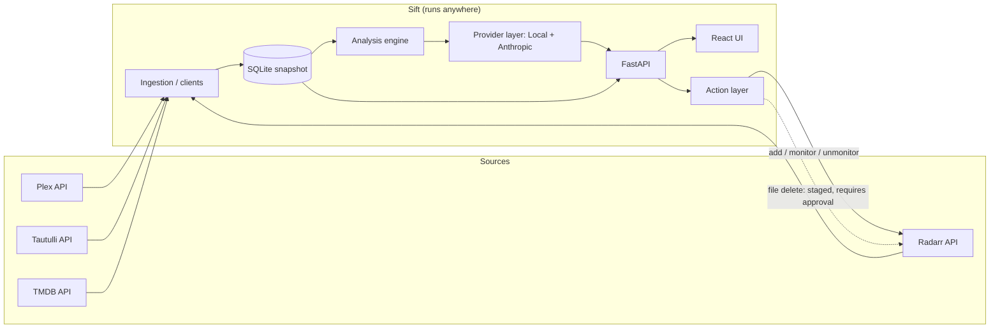

# Sift — Game Plan & Build Spec

> **Sift** is a lightweight, non-Docker companion to *Butlarr*. It runs on a laptop (or any machine) and reaches a self-hosted movie server over the network. It reads Plex + Radarr (+ Tautulli + TMDB), builds a taste profile, then finds **missing** movies, flags **junk** worth removing, helps **organize**, and answers **natural-language questions** about the library. Butlarr stays the heavy on-server, file-plane tool; Sift is the portable metadata brain. They share **no database** — they talk to the same APIs independently.

---

## 0. How Claude Code should use this document

1. **Build Part 1 first** (Sections 1–13) — the MVP app — following the phased plan. Each phase has a "Done when" gate; do not advance until it's met.
2. **Then execute Part 2** — the 80 post-MVP tasks (8 roles × 10). Only start these once the Phase 4 gate is green.
3. **Working conventions:** small, reviewable commits; every behavior change ships with a test; no destructive action path ships without a guarding test; type hints + mypy on backend, TypeScript strict on frontend; never commit secrets. Keep the `YYMM.major.patch` version scheme.
4. **Golden safety rule:** a file delete is only ever issued after an explicit, recorded user approval. This is a hard invariant enforced by tests (see Role 7).

---

## 1. Product summary

| | |
|---|---|
| **What it does** | Ingests the library → caches a snapshot → analyzes it → recommends & (for safe actions) executes → answers questions. |
| **Who uses it** | One technical owner of a family media server (kids have separate Plex libraries). |
| **Where it runs** | Locally, browser UI served by a FastAPI backend. Reaches Plex/Radarr remotely (both confirmed reachable via VPN/Tailscale/proxy). |
| **What it never assumes** | Filesystem access. All analysis is API-only against the cached snapshot; the server may be offline at any time. |

---

## 2. Locked decisions

- **Name:** Sift.
- **Form factor:** Local web app first (FastAPI + browser UI). Packaged as a `uvx`/`pipx`-installable Python app — no Docker required (an optional Docker image is a parity nicety, not the primary path).
- **Autonomy tiers:** adds/monitors = autonomous; Radarr unmonitor/remove-from-catalog = autonomous + audited; **file deletes = always require explicit approval** (most conservative — chosen).
- **Junk detection:** hybrid — deterministic, vote-weighted data decides the score; the LLM only *explains* it, never overrides it.
- **LLM:** provider abstraction supporting Local (Ollama/llama.cpp) and Anthropic, with three modes (route-by-task / compare / race-fallback) and a separate embedding provider slot.
- **Kids guardrail:** items in children's libraries are never auto-flagged for removal on adult-rating grounds; they carry a visible guard chip.

---

## 3. Architecture



**Two planes:** the *metadata plane* (everything above) runs anywhere. The *file plane* (integrity, storage, renames) belongs to Butlarr on the server and is out of scope for Sift except that Sift can *request* a Radarr-side delete, which is gated behind approval.

---

## 4. Tech stack

- **Backend:** Python 3.12, FastAPI, Uvicorn, SQLAlchemy 2.x, Alembic (migrations), Pydantic v2, `httpx` (async clients), `websockets`/SSE for progress + streaming.
- **API clients:** `plexapi`, `pyarr` (Radarr), `tmdbsimple` (or direct `httpx` to TMDB v3), Tautulli via its HTTP API.
- **Storage:** SQLite (portable, travels with the laptop). One file, path configurable.
- **AI:** Anthropic SDK; local via Ollama HTTP API. Embeddings via a pluggable provider (local `nomic-embed`/`bge` through Ollama, or a hosted embedding endpoint).
- **Frontend:** React + Vite + TypeScript + Tailwind, built to static assets and served by FastAPI at `/`. *Rationale:* the feature set (virtualized tables, drawers, side-by-side streaming panes, reorderable cards, theming) is past comfortable HTMX territory, and it continues the Butlarr React lineage. "Lightweight" here means deployment (one package, SQLite, no orchestration), not a no-framework UI. *If you'd prefer smaller runtime, Svelte is an acceptable substitute — do not mix both.*
- **Packaging:** `pyproject.toml` with console entry points; `uvx sift` / `pipx install`.
- **Config:** `sift.toml` + `.env` secret overrides.

---

## 5. Repository structure

```
sift/
  pyproject.toml
  sift.toml.example
  README.md
  CLAUDE.md                      # build guidance for Claude Code
  backend/
    sift/
      main.py                    # FastAPI app + static serving
      config.py                  # TOML/.env loader, settings model
      db/
        models.py                # SQLAlchemy models (Section 6)
        session.py
        migrations/              # Alembic
      clients/
        plex.py  radarr.py  tautulli.py  tmdb.py
        base.py                  # retry/backoff/rate-limit mixin
      ingest/
        pipeline.py              # orchestrates a scan, checkpoints
        normalize.py             # canonical movie identity
      analysis/
        collections.py  junk.py  recommend.py  duplicates.py
        upgrades.py  profile.py  scoring.py
      ai/
        provider.py              # LLMProvider interface + registry
        local.py  anthropic.py  embeddings.py
        query.py                 # grounded RAG over snapshot
        rationale.py             # score-explanation prompts
      actions/
        engine.py                # propose/approve/execute + audit
        radarr_writes.py         # dry-run-capable write wrapper
      api/
        routes_*.py              # Section 8
        ws.py                    # scan progress + ask streaming
      services/
        health.py  audit.py  scheduler.py
    tests/
  frontend/
    src/
      pages/ (Dashboard, Library, Missing, Junk, Ask, Profile, Activity, Settings)
      components/ (MovieDrawer, ScoreBadge, RationaleCard, ConfirmDelete, ModelSelector, ...)
      theme/ (tokens, presets: dark/light/neon, density)
      lib/ (api client, ws hooks)
    tests/ (Playwright e2e)
```

---

## 6. Data model (SQLite snapshot schema)

- **movies** — `tmdb_id` (PK), `radarr_id`, `plex_rating_key`, `imdb_id`, `title`, `year`, `runtime`, `genres` (json), `keywords` (json), `overview`, `poster_url`, `library_section`, `is_kids` (bool), `monitored` (bool), `has_file` (bool), `quality`, `file_size`, `added_at`, `updated_at`.
- **ratings** — `movie_id` (FK), `source` (`tmdb`/`imdb`/`user`), `value`, `votes`.
- **watch_history** — `movie_id` (FK), `plex_user`, `plays`, `last_played_at`, `completion_pct`. (Sourced from Tautulli; aggregated per user, kids accounts flagged.)
- **collections** — `tmdb_collection_id` (PK), `name`, `owned_count`, `total_count`.
- **collection_members** — `collection_id` (FK), `tmdb_id`, `title`, `year`, `owned` (bool).
- **people** — `id`, `name`; **movie_people** — `movie_id`, `person_id`, `job` (director/actor/…).
- **scores** — `movie_id` (FK), `junk_score`, `fit_score` (nullable), `signals` (json breakdown), `model_used`, `computed_at`.
- **profile** — singleton: `weights` (json), `vector` (blob), `updated_at`.
- **actions** — `id`, `type` (`add`/`monitor`/`unmonitor`/`delete`), `movie_id`, `status` (`proposed`/`approved`/`rejected`/`executed`/`failed`), `payload` (json), `dry_run` (bool), `actor` (`auto`/`user`), `created_at`, `executed_at`, `error`.
- **scan_runs** — `id`, `started_at`, `finished_at`, `status`, `checkpoints` (json per phase).
- **settings** — kv/json: connections, model config, thresholds, appearance.

---

## 7. External source-of-truth map

| Source | Authoritative for |
|---|---|
| **Radarr** | Managed catalog, monitored/wanted, quality profile + cutoff, TMDB collection membership, file presence. |
| **Plex** | What's actually playable, per-user watch state, user ratings, kids-vs-adult library separation. |
| **Tautulli** | Reliable watch history: plays, last-played, completion. |
| **TMDB** | External ratings + vote counts, collection/keyword/person graph (the candidate universe for "what's missing"). |

Conflicts resolve by the table above (e.g., "is it owned/monitored?" → Radarr; "have I watched it?" → Tautulli).

---

## 8. Backend API surface

```
GET  /api/health                     # per-service connection status
GET  /api/status                     # scan state, counts, last scan
POST /api/scan                       # start a (resumable) scan
GET  /api/scan/{id}                  # scan run detail
WS   /ws/scan/{id}                   # live progress (ring + phases)

GET  /api/movies?filters…            # paginated, filterable, sortable
GET  /api/movies/{tmdb_id}           # full detail (for drawer)

GET  /api/missing/collections        # collection gaps (owned/missing)
GET  /api/missing/recommendations    # taste-based, ranked by fit
GET  /api/junk                       # removal candidates + signals + rationale

POST /api/actions                    # propose an action (dry-run payload)
POST /api/actions/{id}/approve       # approve (required for deletes)
POST /api/actions/{id}/reject
GET  /api/activity                   # audit log feed

GET  /api/profile
PUT  /api/profile/weights            # edit weights → triggers recompute

POST /api/ask                        # {query, mode: local|anthropic|compare}
WS   /ws/ask                         # streamed tokens (+ two streams in compare)

GET  /api/settings   PUT /api/settings
POST /api/settings/test/{service}    # connection test
```

---

## 9. Analysis engine

- **Collection completeness** (`collections.py`) — join Radarr collections + TMDB collection membership; emit per-collection owned/missing. Deterministic.
- **Junk scoring** (`junk.py` + `scoring.py`) — composite score from independently-weighted signals: (a) **vote-weighted rating** via a Bayesian/IMDb weighted formula so a 4.1★/30-votes ≠ 4.1★/200k-votes; (b) **engagement** (never played / not played in N years / low completion, from Tautulli); (c) **redundancy** (superseded-quality duplicate). Each signal's contribution is stored in `scores.signals` for the UI/LLM. **Kids-section items are excluded from auto-flagging.**
- **Recommendations** (`recommend.py`) — candidate generation from TMDB (collection siblings, `similar`, shared people/keywords) **minus owned**, then ranked by cosine similarity of the candidate embedding to the profile vector → `fit_score`.
- **Taste profile** (`profile.py`) — weighted aggregation over genres/keywords/people/eras from ownership + watch + ratings; produces user-editable weights and a profile embedding.
- **Duplicates & upgrades** (`duplicates.py`, `upgrades.py`) — multiple files per `tmdb_id`; current quality below Radarr cutoff.

---

## 10. AI / provider layer

- **`LLMProvider`** interface: `complete()`, `stream()`, `health()`. Implementations: `LocalProvider` (Ollama), `AnthropicProvider`.
- **`EmbeddingProvider`** interface, separate slot (local or hosted), used only by profile/recommendations.
- **Modes:** `route_by_task` (bulk/cheap → local; hard reasoning + Q&A → Anthropic), `compare` (both, two panes), `race_fallback` (first good answer; auto-fallback if a provider is offline — important when the local model is unreachable remotely).
- **Grounded query** (`query.py`): retrieve relevant movies from the snapshot → build bounded context → answer with source attribution. Prevents hallucinated titles.
- **Rationale** (`rationale.py`): given a computed score + signal breakdown, the LLM explains it in plain language. Prompt explicitly forbids re-judging or changing the score.

---

## 11. Autonomy & safety model

| Action | Reversible? | Policy |
|---|---|---|
| Add / monitor in Radarr | Yes | Autonomous. Audited. |
| Unmonitor / remove-from-catalog (no file delete) | Yes | Autonomous. Audited. Undo window via audit log. |
| **File delete (via Radarr `deleteFiles=true`)** | **No** | **Requires explicit approval.** Confirm modal states irreversibility. Never auto. |

Every action passes through `actions/engine.py`, is recorded in `actions` + the audit log with a dry-run payload, and only transitions to `executed` per the policy above.

---

## 12. Build phases (with acceptance gates)

**Phase 0 — Skeleton + read-only ingestion**
Build config, DB, the four clients, the ingestion pipeline, `/api/scan`, and a first snapshot. Ship the connection-health surface.
*Done when:* a scan against real Plex+Radarr populates `movies`/`ratings`/`watch_history`/`collections`, is resumable, and `/api/status` reports accurate counts.

**Phase 1 — Deterministic analysis**
Collection completeness, duplicates, cutoff-unmet, and the vote-weighted junk score (no LLM yet). Library + Missing + Junk pages read live data.
*Done when:* collection gaps and junk candidates are correct on a known fixture set (golden test), thresholds are configurable, and kids items are excluded from junk.

**Phase 2 — Provider layer + taste profile + recommendations**
`LLMProvider`/`EmbeddingProvider`, the three modes, profile computation, recommendation ranking, and the Ask page (single + compare).
*Done when:* Ask answers are grounded (cite snapshot movies), compare mode shows two panes, and route/fallback works with the local model forced offline.

**Phase 3 — Rationale + review queues + action layer**
LLM rationale on junk/recommendations; propose/approve/reject; autonomous adds/unmonitors; delete-approval flow + audit log + Activity page.
*Done when:* no delete executes without approval (safety test green), adds execute autonomously and appear in the audit log, and every action has a dry-run payload.

**Phase 4 — Customization, polish, packaging**
Themes/density/accent, saved views, editable weights, live threshold preview, `uvx`/`pipx` packaging, `sift init`, scheduler snippet.
*Done when:* installs clean via `uvx sift`, first-run wizard tests all connections, and the UI matches the design system across all three themes at AA contrast.

---

## 13. Non-functionals

- **Remote access:** document a Tailscale (or reverse-proxy) setup so Radarr is reachable without public exposure. Bind the Sift web server to localhost by default; token-gate the API.
- **Resilience:** every client has retry/backoff + rate limiting; a scan survives a mid-run server drop (checkpointed, resumable); the UI degrades gracefully when a source is offline.
- **Security:** secrets encrypted at rest (OS keychain or encrypted config), redacted from logs; append-only audit log; minimal Radarr write scope.
- **Performance:** flat-memory streaming ingestion; virtualized tables; target smooth handling of 10k+ movies.

---
---

# Part 2 — The 80 Post-MVP Tasks

**Execution rules (apply to every task below):**
- Start only after the **Phase 4 gate** is green.
- Each task is **unique**, independently **revertible**, ships **with tests**, and must **not regress** existing behavior (especially the delete-approval invariant).
- Each task should **add, improve, or remove** something with a clear positive impact.
- Tasks **may interact** with others; where they do, it's noted with `↔`.

## Role 1 — Backend & Integrations Engineer
1. Incremental/delta sync using Radarr & Plex `updated` timestamps so scans re-pull only what changed. `↔` R1.7
2. Unified retry/backoff-with-jitter + rate limiting in `clients/base.py`, applied to all four clients (TMDB the tightest). `↔` R1.3
3. Response caching layer: ETag/If-Modified-Since where supported, TTL cache for TMDB metadata. `↔` R3.7
4. Background connection-health poller feeding the UI status dots via `/api/health`. `↔` R5.8
5. Canonical identity resolver mapping `tmdb_id` ⇄ Plex `ratingKey` ⇄ Radarr `movieId`, with collision handling. `↔` R7.7
6. Streaming, flat-memory ingestion (paginated) so a 10k+ library never balloons RSS. `↔` R7.9
7. Resumable scans: per-phase checkpoints in `scan_runs.checkpoints`; interrupted remote scan resumes. `↔` R7.10
8. Tautulli history ingestion with per-user aggregation, tagging kids accounts distinctly. `↔` R2.4, R8.6
9. Alembic migration framework so schema changes never break an existing snapshot DB. `↔` R6.5
10. A dry-run-capable Radarr write wrapper (`radarr_writes.py`) that logs intended payloads without sending. `↔` R7.3

## Role 2 — Data & Analysis Engineer
1. Vote-weighted rating normalization (Bayesian/IMDb weighted formula) to kill low-vote noise in junk scoring.
2. Collection-completeness detector emitting owned/missing per collection from Radarr + TMDB. `↔` R4.? Missing page
3. Duplicate/version detector (multiple files per `tmdb_id`, superseded quality) with a keep-best heuristic. `↔` R2.5
4. Composite junk score with individually-inspectable, weighted signal contributions stored in `scores.signals`. `↔` R3.6
5. Cutoff-unmet / upgrade detector comparing current quality to the Radarr profile cutoff. `↔` R2.3
6. Taste-profile computation: weighted aggregation over genre/keyword/person/era from ownership + watch + ratings. `↔` R3.10
7. Recommendation candidate generator (TMDB similar + shared people/keywords + collection siblings) minus owned.
8. Fit-score ranker via cosine similarity of candidate embedding to the profile vector. `↔` R3.3
9. "Explain-score" data objects so UI/LLM render rationale without recomputation. `↔` R3.6
10. Threshold simulation endpoint: given proposed thresholds, count how many items would flag (Settings live-preview). `↔` R4 Settings

## Role 3 — AI / LLM Orchestration Engineer
1. `LLMProvider` interface + `LocalProvider` (Ollama) + `AnthropicProvider`.
2. Implement route-by-task / compare / race-fallback modes with health-aware routing. `↔` R1.4
3. Separate `EmbeddingProvider` slot (local vs hosted), independent of the chat model. `↔` R2.8
4. Grounded query pipeline (retrieve → bounded context → answer with source chips) to prevent hallucination.
5. Token streaming to the Ask page over WS/SSE, including dual streams in compare mode. `↔` R4 Ask
6. Rationale prompt templates that explain a given score and are forbidden from re-judging it. `↔` R2.4, R2.9
7. LLM response cache + dedupe for identical queries to cut cost/latency. `↔` R1.3
8. Per-provider cost + latency meter surfaced to the compare view. `↔` R4 Ask
9. Graceful degradation: local offline → auto-fallback to Anthropic, flagged in the UI. `↔` R3.2
10. Incremental embedding recompute triggered on profile-weight changes (not a full rebuild). `↔` R2.6

## Role 4 — Frontend Engineer
1. Library page: grid/table toggle, user-selectable columns, virtualized rendering for large libraries.
2. Saved & named filter views persisted to backend settings. `↔` R6.2
3. Movie Detail drawer with the "advanced / raw metadata" JSON expander.
4. Junk/Removal page: rationale cards + per-signal contribution bars. `↔` R2.4
5. Destructive-approval modal — keyboard-operable, explicit irreversibility copy. `↔` R8.4
6. Ask page: single + side-by-side compare panes with source chips. `↔` R3.5
7. Live scan progress (WebSocket): progress ring + phase checklist. `↔` R1.7
8. Dashboard with reorderable/hideable cards persisted per user.
9. Taste Profile page: editable weight sliders + recompute trigger. `↔` R2.6
10. Global search (jump-to-movie) with keyboard shortcut + fuzzy matching.

## Role 5 — UX & Design Systems Engineer
1. Three theme presets (Minimal Dark/Light/Neon) as CSS-variable token sets.
2. Global density toggle (Comfortable/Compact) affecting spacing + type.
3. Custom accent-color picker with automatic AA-contrast validation. `↔` R5.1
4. Motion system: duration/easing tokens + `prefers-reduced-motion` handling.
5. Semantic score colors always paired with a label/icon (never color-alone). `↔` R4.4
6. Skeleton loaders for every async surface (no blank spinners). `↔` R4.1
7. Focus-visible styles + a full keyboard tab-order audit across tables/drawers. `↔` R7.8
8. Connection-health status component (dots → hover detail). `↔` R1.4
9. Empty-state copy + illustration for each page.
10. Smooth theme cross-fade transition on switch.

## Role 6 — DevOps & Packaging Engineer
1. Package as `uvx`/`pipx` app with `sift serve` / `sift scan` / `sift apply` entrypoints.
2. TOML config + `.env` secret overrides + a `sift init` first-run scaffolder. `↔` R4.2
3. First-run "Test connection" flow for each service. `↔` R4 Settings
4. Documented Tailscale/reverse-proxy template for safely reaching Radarr remotely.
5. SQLite backup + rotation before any migration or destructive batch. `↔` R1.9
6. CI: lint, type-check (mypy + tsc), and the test suite on GitHub.
7. Structured logging with levels + a log feed to the Activity page. `↔` R8.2
8. Scheduler option (cron/launchd snippet or `--watch`) since it's not an always-on container.
9. Version + changelog automation preserving the `YYMM.major.patch` scheme.
10. Optional Docker image for users who *do* want it on-server — parity path, never required.

## Role 7 — QA & Test Automation Engineer
1. Contract tests for all four clients against recorded fixtures (VCR-style). `↔` R1.2
2. Golden-dataset test for junk scoring (known inputs → expected scores) to lock against regressions. `↔` R2.4
3. Safety test asserting NO delete call is ever issued without an approval token. `↔` R8.4 (the golden invariant)
4. Kids-guard test: a low-adult-rating film in a kids section is never auto-flagged for delete. `↔` R2, R8.6
5. Dry-run integration harness running a full scan against a mock server. `↔` R1.10
6. `LLMProvider` contract tests using a deterministic stub provider. `↔` R3.1
7. Property-based tests for cross-source ID normalization. `↔` R1.5
8. Playwright e2e for the delete-approval flow. `↔` R4.5
9. Performance test for a 10k+ movie library (ingestion + render). `↔` R1.6
10. Regression test for resumable scans (interrupt → resume == uninterrupted result). `↔` R1.7

## Role 8 — Security & Data Governance Engineer
1. Encrypt API keys/tokens at rest (OS keychain or encrypted config); never plaintext.
2. Secret redaction across all logs + error surfaces. `↔` R6.7
3. Append-only, tamper-evident audit log for every action (deletes especially). `↔` R4 Activity
4. Two-step confirm + optional cooling-off for bulk deletes. `↔` R4.5, R7.3
5. Enforce minimal Radarr write scope, gated behind the autonomy-tier policy.
6. Per-user Plex data handling that respects children's accounts (no cross-profile leakage). `↔` R1.8
7. Local-origin/CSRF protection: bind localhost, token-gate the API.
8. Undo window for reversible actions (add/unmonitor) via the audit log. `↔` R8.3
9. `sift wipe` command that cleanly removes the local snapshot + secrets.
10. Dependency vulnerability scanning + a pinned lockfile. `↔` R6.6
